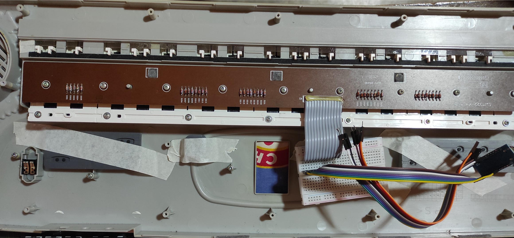
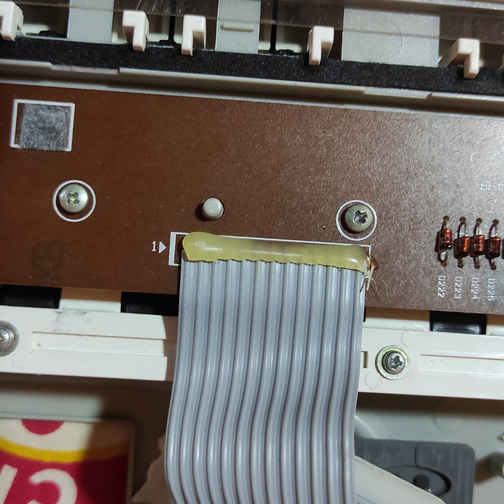
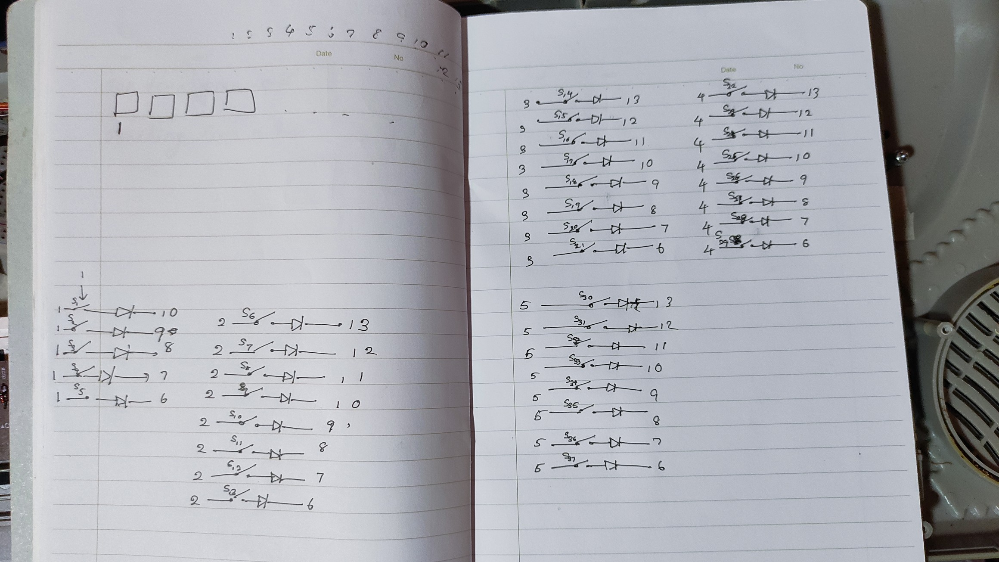
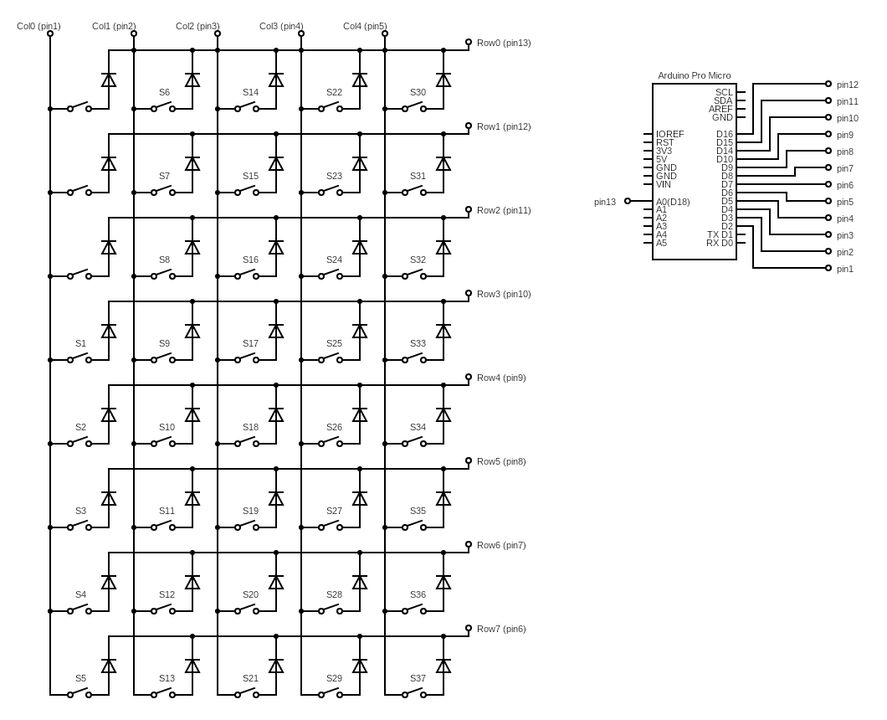

## Casio SA-75 MIDI conversion
I made this project to convert my old Casio keyboard into a MIDI device that works with almost any DAW that supports USB MIDI using an Arduino Pro Micro clone.

### Features
- Plug & Play (Does not require any additional software)
- Should work with most DAWs (Only tested in FL Studio and Ableton Live, but key tested in MidiView).

### Requirements
- Sparkfun Pro Micro Clone or an Arduino Leonardo (With ATmega32U4 MCU)
- Arduino IDE (tested in version 2.1.1)

### Test Hardware setup
(I'm making this as a part of a bigger project, so Everything is temporarily wired for testing purposes)

# Note that Pin 1 starts at the arrow

### Schematics and circuit diagram
I had to manually test and trace the paths to figure out the rows and columns.

